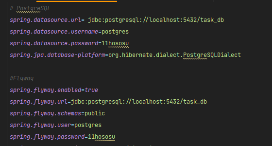

# Aster: Тестовое задание

# Установка

### Использованный стек - Java 17, Spring Boot, PostgreSQL, Swagger OpenAPI, Spring Security

# Краткое описание проекта
### Данный проект представляет собой реализацию идеи to-do-list с возможность создания задачи (Task), закрытием задачи и т.д.
### В проекте так же реализовано security через JWT токен

-------
## Настройки для подключения к базе данных
### При проблемах с подключением к базе данных, может помочь смена пароля и юзера от постгре в [application.properties](src/main/resources/application.properties) на локальном устройстве


# Список endpoint'ов

## Нужные эндпоинты можно найти по ссылке на Swagger документацию

```
http://localhost:8080/swagger-ui/index.html#/
```
